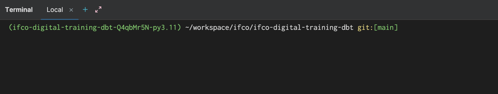

#### Configure the IDE to work with the virtual environment

Configure the IDE to work with the poetry environment created. To do so, find the poetry environment path by executing the following command in the project root:

    poetry env list --full-path

Append `/bin/python` to the path and add it to the IDE:

 - [IntelliJ tutorial](https://www.jetbrains.com/help/idea/configuring-python-sdk.html#-7tt9nh_91)
 - [PyCharm tutorial](https://www.jetbrains.com/help/pycharm/poetry.html#existing-poetry-environment)

Among other things, everytime you open a terminal you should see the env activated

If you are working with PyCharm, you can set the DBT path:

 - [Config DBT for PyCharm](https://www.jetbrains.com/help/pycharm/create-and-configure-dbt-project.html#configure-data-source)

Just add the DBT path and click Apply, do not configure a data source